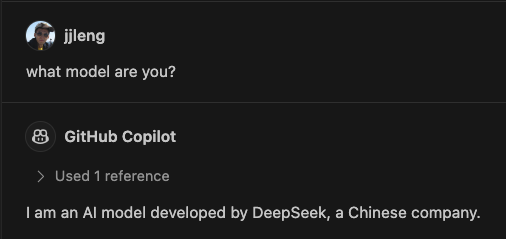

# Copilot Proxy

Make VS Code GitHub Copilot work with any open weight models, Llama3, DeepSeek-Coder, StarCoder, etc.
This should work even you are not a Copilot subscriber.

<div>
  
</div>

## 🌟 Motivations
- I'm already familiar with and enjoy using the GitHub Copilot extension (yes, I know there are other awesome extensions, such as Continue.).
- Copilot may not always utilize the latest GPT models. It currently uses models like `gpt-4-0125-preview`, `gpt-3.5-turbo` and others.
- Transferring code from the editor to ChatGPT to use GPT-4o is inconvenient.
- I'm interested in using alternative models such as Llama3, DeepSeek-Coder, StarCoder, and Sonnet 3.5.
- I have subscriptions to both ChatGPT and Copilot but would like to cancel my Copilot subscription.


## 🏃‍♂️ How to Run

1. Install copilot_proxy

    ```bash
    git clone https://github.com/jjleng/copilot-proxy.git
    cd copilot-proxy
    # install dependencies
    poetry install
    # build and install copilot_proxy as a runnable script
    poetry build && pip uninstall copilot_proxy -y && ls dist/*.whl | sort -V | tail -n 1 | xargs pip install
    # verify that the script has been installed successfully
    copilot_proxy --version
    ```

2. Run copilot_proxy with Ollama models, OpenRouter models or any OpenAI API compatible endpoints

   ```bash
    # Ollama
    MODEL_URL="http://localhost:11434/v1/chat/completions" MODEL_NAME="llama3:instruct" MODEL_API_KEY="whatever" copilot_proxy start
    # OpenRouter
    MODEL_URL="https://openrouter.ai/api/v1/chat/completions" MODEL_NAME="deepseek/deepseek-coder" MODEL_API_KEY="YOUR_KEY" copilot_proxy start
   ```

3. Install mitmproxy certificate

   copilot_proxy uses mitmproxy to proxy the Copilot traffic. You need to install the mitmproxy certificate.
   After first run, you should find cert files under ~/.mitmproxy. See https://docs.mitmproxy.org/stable/concepts-certificates/ for details.

   Quick guides to import the CA certificate to your operating system.

   **Windows (not verified)**
   - Open the Windows Start menu and type `mmc` to open the Microsoft Management Console.
   - Go to `File` -> `Add/Remove Snap-in...`.
   - Select `Certificates` and click `Add`.
   - Choose `Computer account` and click `Next`.
   - Select `Local computer` and click `Finish`.
   - Click `OK` to close the snap-in window.
   - In the console, expand `Certificates (Local Computer)` -> `Trusted Root Certification Authorities` -> `Certificates`.
   - Right-click on `Certificates` and choose `All Tasks` -> `Import`.
   - Follow the import wizard, select `Browse`, and navigate to the `mitmproxy-ca-cert.pem` file. Make sure to select `All Files` to see the `.pem` file.
   - Finish the import process.

   **Mac (verified)**
   - Open `Keychain Access` from `Applications` -> `Utilities`.
   - Import it into the `System` keychain.
   - In the `File` menu, select `Import Items`.
   - Navigate to `~/.mitmproxy` and select the `mitmproxy-ca-cert.pem` file.
   - Find the imported certificate in the list, right-click it, and select `Get Info`.
   - Expand the `Trust` section and set `When using this certificate` to `Always Trust`.
   - Close the info window and authenticate with your password to apply the changes.

   **Linux (not verified)**
   - Copy the `mitmproxy-ca-cert.pem` file to the system certificate directory:
     ```bash
     sudo cp ~/.mitmproxy/mitmproxy-ca-cert.pem /usr/local/share/ca-certificates/mitmproxy-ca-cert.crt
     ```

   - Update the certificate store:
     ```bash
     sudo update-ca-certificates
     ```

   Restart copilot_proxy

4. Setup the proxy in VS Code

   Follow the guide here:
   https://docs.github.com/en/copilot/managing-copilot/configure-personal-settings/configuring-network-settings-for-github-copilot
    <div align="center">
      
    </div>

## ✨ Code Completion
For code completions, the best result will be calling the model through the FIM (fill-in-the-middle) template. This can be done by calling the `/completion` endpoint with the `suffix` parameter. If your inference server is compatible with OpenAI `/completion` endpoint and supports the `suffix` parameter, you can get better completions by using the code in the `completion` branch. This setup will produce the best result.

NOTICE: Ollama doesn't support the `/completion` endpoint and vLLM doesn't support the `suffix` parameter.

Code from the `main` branch works well with Copilot chat, but might not produce high quality completions. However, it is agnostic about the inference servers.

## 🤔 Why not go the simpler route?
In VS Code settings, we can
```json
{
  "github.copilot.advanced": {
    "debug.testOverrideProxyUrl": "http://localhost:11434",
    "debug.overrideProxyUrl": "http://localhost:11434"
  }
}
```

This did not work for me.
- Only code completion triggers the endpoint, chatbox does not.
- Seems I need to keep the Copilot subscription?
- Flexibility.
